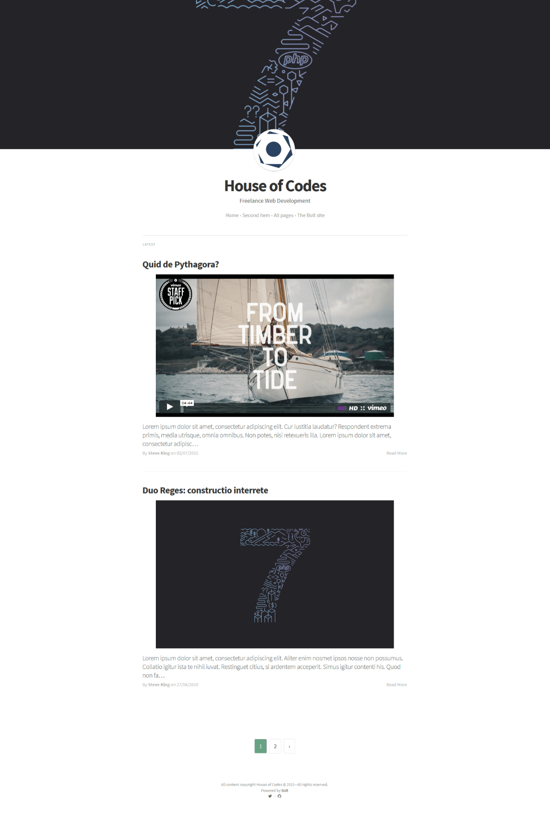

## Bolt-Medium by JustSteveKing 
===================

**Note:**  This is for Bolt 3. Check out the `bolt-v2` branch for a Bolt 2 compatible version.

### Introduction

This is the Bolt-Medium theme for Bolt. A theme aimed at blogging with minimal pages. This is a Bolt port of the Jekyl and Ghost themes.

### Configuration

Have a look in the config.yml file and set a few of your own globals there. I have included the layouts directory so that you can upload this to your /web_root/files directory and have this running the same as my example. 

Don't forget to clear yor cache every time you make changes.

Check the screenshots folder to discover more of this theme.

Any issues give me a shout on twitter https://www.twitter.com/JustSteveKing